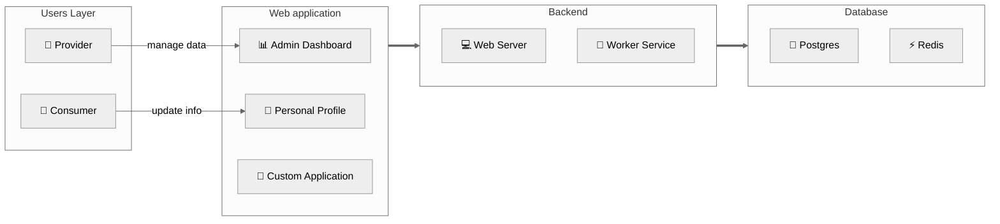

## Mô hình tổng quan

RoxaVN là framework **fullstack**, lo luôn cả backend lẫn frontend. Nói cách khác, “trọn gói từ A đến Z”.

### 1. Lớp người dùng
- **Nhà cung cấp:** tổ chức hoặc cá nhân sử dụng RoxaVN để “dựng cửa hàng, mở dịch vụ”, cung cấp đủ thứ cho khách hàng.
- **Khách hàng:** người dùng cuối, là thượng đế của bạn 👑.

### 2. Giao diện người dùng
- **Admin dashboard:** nơi nhà cung cấp vào “điều hành thế giới” — quản lý user, dịch vụ, v.v.  
   - 🛠️ Truy cập: `/admin/apps`
- **Personal profile:** chỗ khách hàng tự “tút lại profile”, chỉnh tên, thay avatar, đổi mood.  
   - 👤 Truy cập: `/me`
- **Custom application:** nếu thấy chưa đủ, bạn có thể “nấu món riêng”, phát triển ứng dụng web tùy mô hình kinh doanh.

### 3. Thành phần backend

Hệ thống của RoxaVN chia làm hai “nhân vật chính”: một anh “giao tiếp xã hội” và một anh “ở hậu trường làm việc quần quật” 😆  

#### 🛰️ 3.1. Web Server – Anh chàng nói nhiều  

Đây là mặt tiền của RoxaVN, nơi xử lý **RESTful API** và **WebSocket**. Nói cách khác, đây là “người phát ngôn chính thức” –  client hỏi gì, anh này trả lời; có socket kết nối, anh này chat lại liền. Không có web server thì cả hệ thống im như chùa mùa mưa. 🧘‍♂️

#### 🧱 3.2. Worker Service – Công nhân ẩn danh

Phía sau ánh đèn sân khấu, **Worker Service** là người cày cuốc thầm lặng:  
- Chạy **cronjob** định kỳ (kiểu như nhắc “Ê, hôm nay quét dữ liệu chưa?”).  
- Lắng nghe **event từ API hoặc database** rồi xử lý trong im lặng.
- Làm hết mấy việc “nặng nhọc” để Web Server không bị stress 🤯

#### 💻 Trong môi trường dev  

Khi bạn chạy `npm run dev` RoxaVN sẽ load cả Web Server lẫn Worker Service trong cùng một tiến trình. Tất cả cùng sống hòa bình, giúp dev test dễ dàng hơn – không cần mở 100 terminal. Chạy 1 lệnh, 2 anh lên sàn cùng lúc 🎭.

#### 🚀 Trong môi trường production

Khi deploy thật, mọi thứ nghiêm túc hơn:

- Lệnh `npm start` chỉ khởi động Web Server – để phục vụ client.
- Còn Worker Service được tách riêng:
    - Chạy cronjob `npx roxavn worker --schedule`
    - Chạy task lắng nghe event `npx roxavn worker --normal`

Nhờ tách riêng như vậy, hệ thống ổn định, dễ scale, và nếu Worker có “lăn ra ngủ quên”, Web Server vẫn tiếp tục hoạt động ngon lành 😴.

### 4. Database

Đây là tầng dưới cùng, đảm nhận lưu trữ dữ liệu với Postgres. Ngoài ra bạn có thể cache dữ liệu với Redis giúp tăng cường hiệu suất cho hệ thống.
