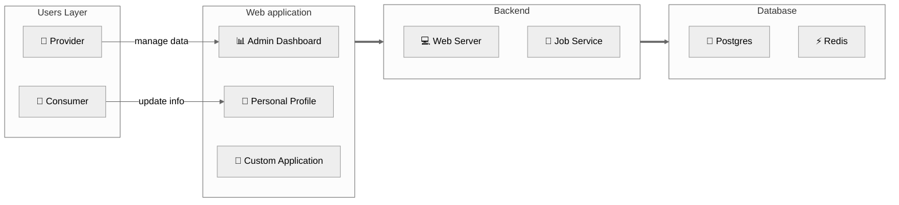

## Mô hình tổng quan

RoxaVN là framework **fullstack**, lo luôn cả backend lẫn frontend. Nói cách khác, “trọn gói từ A đến Z”.



### 1. Lớp người dùng
- **Nhà cung cấp:** tổ chức hoặc cá nhân sử dụng RoxaVN để “dựng cửa hàng, mở dịch vụ”, cung cấp đủ thứ cho khách hàng.
- **Khách hàng:** người dùng cuối, là thượng đế của bạn 👑.

### 2. Giao diện người dùng
- **Admin dashboard:** nơi nhà cung cấp vào “điều hành thế giới” — quản lý user, dịch vụ, v.v.  
   - 🛠️ Truy cập: `/admin/apps`
- **Personal profile:** chỗ khách hàng tự “tút lại profile”, chỉnh tên, thay avatar, đổi mood.  
   - 👤 Truy cập: `/me`
- **Custom application:** nếu thấy chưa đủ, bạn có thể “nấu món riêng”, phát triển ứng dụng web tùy mô hình kinh doanh.

### 3. Thành phần backend

Hệ thống của RoxaVN chia làm hai “nhân vật chính”: một anh “giao tiếp xã hội” và một anh “ở hậu trường làm việc quần quật” 😆  

#### 3.1. Web Server – Anh chàng nói nhiều  

Đây là mặt tiền của RoxaVN, nơi xử lý **RESTful API** và **WebSocket**. Nói cách khác, đây là “người phát ngôn chính thức” –  client hỏi gì, anh này trả lời; có socket kết nối, anh này chat lại liền. Không có web server thì cả hệ thống im như chùa mùa mưa. 🧘‍♂️

#### 3.2. Job Service – Công nhân ẩn danh

Phía sau ánh đèn sân khấu, **Job Service** là người cày cuốc thầm lặng:  
- Chạy **cronjob** định kỳ (kiểu như nhắc “Ê, hôm nay quét dữ liệu chưa?”).  
- Lắng nghe **event từ API hoặc database** rồi xử lý trong im lặng.
- Làm hết mấy việc “nặng nhọc” để Web Server không bị stress 🤯

RoxaVN chia Job Service thành hai vai trò chính:

1. **Job Worker** là tiến trình thực thi các tác vụ (job) được giao. Có thể chạy nhiều process song song để tăng khả năng xử lý. Đặc điểm:
     - Mỗi worker lắng nghe hàng đợi job
     - Khi nhận được job, worker sẽ xử lý
     - Có thể scale theo số lượng CPU hoặc pod khi triển khai trên Kubernetes. 
2. **Job Dispatcher** chịu trách nhiệm tạo và phát các job cho worker. Nó chỉ nên chạy một process duy nhất trong hệ thống. Nhiệm vụ chính:
     - Kích hoạt các job theo lịch định kỳ (cron).
     - Lắng nghe các sự kiện từ Database hoặc các service khác.
     - Gửi job đến queue để các worker thực hiện.

##### Trong môi trường dev  

Khi bạn chạy `npm run dev` RoxaVN sẽ load cả Web Server lẫn Job Service trong cùng một tiến trình. Tất cả cùng sống hòa bình, giúp dev test dễ dàng hơn – không cần mở 100 terminal. Chạy 1 lệnh, 2 anh lên sàn cùng lúc 🎭.

##### Trong môi trường production

Khi deploy thật, mọi thứ nghiêm túc hơn:

- Lệnh `npm start` chỉ khởi động Web Server – để phục vụ client.
- Còn Job Service được tách riêng:
    - Chạy job worker `npx roxavn job -w`. Có thể chạy nhiều process.
    - Chạy job dispatcher `npx roxavn job -d`. Chỉ chạy 1 process để bắn các event theo cron, hay event từ database cho các job worker thực hiện.
    - Hoặc chạy cả job worker lẫn job dispatcher `npx roxavn job`. Chỉ chạy 1 process, thích hợp cho ứng dụng nhỏ, không cần nhiều job worker xử lý. Nếu chạy nhiều process, sẽ khiến các cron job bị kích hoạt nhiều lần. 

Nhờ tách riêng như vậy, hệ thống ổn định, dễ scale, và nếu Worker có “lăn ra ngủ quên”, Web Server vẫn tiếp tục hoạt động ngon lành 😴.

### 4. Database

Đây là tầng dưới cùng, đảm nhận lưu trữ dữ liệu với Postgres. Ngoài ra bạn có thể cache dữ liệu với Redis giúp tăng cường hiệu suất cho hệ thống.


## Module Structure

<pre>
test-module/
├── src/
│   ├── base/             # contains shared code for both server/ and web/
│   │   ├── module.ts     # declares the module
│   │   ├── access.ts     # declares scopes, permissions, and roles
│   │   ├── errors.ts     # declares errors
│   │   └── apis          # API declarations
│   │       ├── task.ts   # API for `task` entity
│   │       └── group.ts  # API for `group` entity
│   │
|   ├── server/           # backend code
│   │   ├── module.ts     # backend module declaration
│   │   ├── migrations/   # database migration files
│   │   └── services/     # service files that implement APIs or jobs
│   │
|   ├── hook/             # hook services, executed via `npx roxavn hook`
│   │
|   └── web/                  # frontend code
│       ├── admin/            # pages for admin app
│       ├── me/               # pages for me app
│       ├── pages/            # route declarations, <a href="https://remix.run/docs/en/1.19.3/file-conventions/routes-files">details</a>
│       │   └── abc.tsx       # page route: http://[DEV_SERVER]/abc
│       └── export/           # shared components for me app
│           ├── module.ts     # web module declaration
│           └── components/   # shared React components
|
├── static/            # static files
│   ├── locales/       # localization files
│   │   ├── en.json    # English language file
│   │   └── vi.json    # Vietnamese language file
|   ├── icon.svg       # module icon
|   ├── abc.txt        # arbitrary files
|   └── test/
|       └── a.png      # file path: http://[DEV_SERVER]/static/test-module/test/a.png
|
├── dist/              # for publishing the module, created via `npx roxavn build`
├── .web/              # dev build artifacts, created via `npx roxavn sync`
└── package.json
</pre>

## Code Convention

### 1. Git

RoxaVN tuân thủ chuẩn [Conventional Commits](https://www.conventionalcommits.org/en/v1.0.0/) để đảm bảo tính nhất quán trong lịch sử commit.

- Mỗi commit **chỉ thực hiện một nhiệm vụ duy nhất** (ví dụ: *fix bug*, *update UI*, *refactor code*).  
- Tuyệt đối không gộp nhiều loại thay đổi (như vừa sửa lỗi, vừa cập nhật giao diện) trong cùng một commit.  
- Tên commit phải tuân theo định dạng chuẩn, ví dụ:

  ```
  feat(auth): add login via Google
  fix(ui): correct button alignment on mobile
  chore(deps): update eslint config
  ```

### 2. JavaScript Packages

RoxaVN chỉ sử dụng **ES Module** nhằm tối ưu hóa quá trình build client (đặc biệt là hỗ trợ **tree-shaking**).

Vì vậy, trong file `package.json` của mỗi package cần khai báo rõ:

```json
{
  "type": "module"
}
```

> ⚠️ Không sử dụng CommonJS (`require`, `module.exports`) trong bất kỳ package nào.

Khi import các file trong dự án, bắt buộc phải thêm đuôi **`.js`** để tương thích với chuẩn **ES Module**.  

Ví dụ:

```ts
import { program } from './program.js';
```

> ⚠️ Nếu thiếu phần mở rộng .js, quá trình build hoặc runtime có thể gặp lỗi ERR_MODULE_NOT_FOUND trong môi trường Node.js ESM.

Ngoài ra trong `package.json` của mỗi module cũng phải khai báo exports các submodule `base`, `server`, `web`

> Khi chạy `npx roxavn gen module` đã tự động tạo cho bạn

```json
{
  "exports": {
    ".": {
      "types": "./dist/esm/index.d.ts",
      "default": "./dist/esm/index.js"
    },
    "./web": {
      "types": "./dist/esm/web/index.d.ts",
      "default": "./dist/esm/web/index.js"
    },
    "./base": {
      "types": "./dist/esm/base/index.d.ts",
      "default": "./dist/esm/base/index.js"
    },
    "./server": {
      "types": "./dist/esm/server/index.d.ts",
      "default": "./dist/esm/server/index.js"
    }
  },
}
```

| Submodule    | Mục đích                                                     |
| ------------ | ------------------------------------------------------------ |
| `"."`        | Export chính của module (dùng chung)                         |
| `"./base"`   | Chứa logic dùng chung giữa web & server                      |
| `"./server"` | Dành cho backend (middleware, service, …)                    |
| `"./web"`    | Dành cho các thành phần frontend (React hooks, component, …) |

### 3. Quy tắc đặt tên

| Thành phần                   | Quy tắc đặt tên | Ví dụ                        |
| ---------------------------- | --------------- | ---------------------------- |
| **Class**                    | PascalCase      | `UserService`, `AuthManager` |
| **Biến / Hàm thông thường**  | camelCase       | `userList`, `fetchData()`    |
| **React Component Function** | PascalCase      | `ApiTable`, `ApiFetcher`     |
| **Hằng số (constant)**       | UPPER_CASE      | `MAX_RETRY_COUNT`, `API_URL` |

### 4. Độ dài mã nguồn

Để giữ cho mã nguồn dễ đọc, dễ bảo trì và dễ review, cần tuân thủ các giới hạn sau:

| Loại mã nguồn         | Giới hạn khuyến nghị | Giới hạn tối đa |
| --------------------- | -------------------- | --------------- |
| **File**              | 100 – 200 dòng       | < 500 dòng      |
| **Function / Method** | 10 – 50 dòng         | < 100 dòng      |

> ✅ Nếu một file hoặc function vượt quá giới hạn, cần xem xét **tách nhỏ** hoặc **refactor** để tăng khả năng tái sử dụng và dễ kiểm thử.

### 5. Môi trường phát triển

Khuyến nghị sử dụng VSCode làm trình soạn thảo chính để đảm bảo đồng bộ môi trường làm việc giữa các thành viên trong dự án. Sau khi khởi tạo dự án, nên chạy lệnh `npx roxavn gen module convention` để tạo các cấu hình tiêu chuẩn:

- Cấu hình BiomeJS để định dạng và lint code (thay thế ESLint + Prettier)
- Thiết lập Lefthook để kiểm tra:
    - commit message có tuân theo Conventional Commits hay không
    - đảm bảo format code và lint tự động trước khi commit.

> 💡 BiomeJS giúp cải thiện tốc độ lint/format đáng kể và giảm độ phức tạp trong cấu hình.

Ngoài việc khởi tạo convention ban đầu, bạn có thể chạy lệnh `npx roxavn gen editor vscode` để tối ưu trải nghiệm phát triển trên **VSCode**. Lệnh này sẽ tự động:
- Tạo code snippets giúp viết nhanh các đoạn mã RoxaVN phổ biến.
- Thiết lập cấu hình launch cho phép debug các RoxaVN module.
- Cấu hình thuộc tính "importModuleSpecifierEnding" trong VSCode để đảm bảo tự động thêm đuôi `.js` khi import module ES.

### 6. Phiên bản và quy ước đặt version

Từ **phiên bản 4 trở đi**, RoxaVN tuân thủ chuẩn [Semantic Versioning (SemVer)](https://semver.org/) với format `MAJOR.MINOR.PATCH`


| Thành phần | Ý nghĩa                                                         | Ví dụ thay đổi |
| ---------- | --------------------------------------------------------------- | -------------- |
| **MAJOR**  | Thay đổi lớn, có thể phá vỡ tương thích (breaking changes).     | 4.x.x → 5.0.0  |
| **MINOR**  | Thêm tính năng mới, **tương thích ngược**.                      | 4.1.0 → 4.2.0  |
| **PATCH**  | Sửa lỗi, tối ưu hoặc thay đổi nhỏ, **không ảnh hưởng** đến API. | 4.2.0 → 4.2.1  |

- Mọi module trong hệ sinh thái RoxaVN đều đồng bộ theo cùng version gốc của framework.
- Khi cập nhật phiên bản **MAJOR**, bạn nên kiểm tra lại các API để đảm bảo tương thích.
