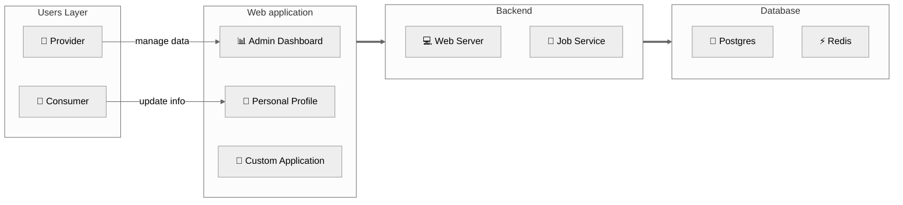

## Mô hình tổng quan

RoxaVN là framework **fullstack**, lo luôn cả backend lẫn frontend. Nói cách khác, “trọn gói từ A đến Z”.


```mermaid
---
config:
  theme: neutral
---
flowchart LR
  subgraph L1["Users Layer"]
    provider["🏢 Provider"]
    consumer["🤵 Consumer"]
  end
  subgraph L2["Web application"]
    adminDashboard["📊 Admin Dashboard"]
    personalProfile["🪪 Personal Profile"]
    customApplication["🧩 Custom Application"]
  end
  subgraph L3["Backend"]
    webServer["💻 Web Server"]
    jobService["🔁 Job Service"]
  end
  subgraph L4["Database"]
    postgres["🐘 Postgres"]
    redis["⚡ Redis"]
  end

  provider -- manage data --> adminDashboard
  consumer -- update info --> personalProfile
  L2 ==> L3
  L3 ==> L4
```

### 1. Lớp người dùng

RoxaVN phân chia hệ thống thành hai nhóm người dùng chính:

* **Nhà cung cấp (Provider):** tổ chức hoặc cá nhân sử dụng RoxaVN để xây dựng và vận hành dịch vụ, ứng dụng hoặc nền tảng kinh doanh.
* **Khách hàng (End User):** người dùng cuối trực tiếp sử dụng các dịch vụ được cung cấp trên hệ thống.

### 2. Giao diện người dùng

#### Admin Dashboard

Khu vực quản trị dành cho nhà cung cấp, phục vụ việc quản lý toàn bộ hệ thống như:

* Người dùng
* Dịch vụ
* Nội dung
* Cấu hình hệ thống
* Quy trình nghiệp vụ

**Đường dẫn truy cập:**
`/admin/apps`

#### Personal Profile

Khu vực cá nhân dành cho người dùng cuối, cho phép:

* Cập nhật thông tin cá nhân
* Quản lý avatar
* Thay đổi cài đặt tài khoản
* Tùy chỉnh trải nghiệm sử dụng

**Đường dẫn truy cập:**
`/me`

#### Custom Application

Ngoài các thành phần mặc định, RoxaVN cho phép phát triển thêm các ứng dụng web tùy chỉnh phù hợp với từng mô hình kinh doanh hoặc nhu cầu nghiệp vụ riêng.

### 3. Thành phần Backend

Kiến trúc backend của RoxaVN được chia thành hai thành phần chính nhằm tách biệt xử lý request thời gian thực và xử lý nền (*background processing*).

#### 3.1. Web Server

Web Server là thành phần chịu trách nhiệm:

* Xử lý RESTful API
* Quản lý kết nối WebSocket
* Điều phối request/response từ client
* Xác thực và phân quyền người dùng
* Cung cấp dữ liệu cho frontend

Đây là entry point chính của toàn bộ hệ thống và đóng vai trò giao tiếp trực tiếp với client.

#### 3.2. Job Service

Job Service đảm nhận các tác vụ xử lý nền và các nghiệp vụ không cần phản hồi tức thời, bao gồm:

* Thực thi cron job theo lịch
* Xử lý event bất đồng bộ
* Đồng bộ dữ liệu
* Gửi email, notification hoặc các tác vụ dài hạn
* Giảm tải cho Web Server

RoxaVN tách Job Service thành hai vai trò riêng biệt:

##### Job Worker

Job Worker là tiến trình thực thi các tác vụ được đưa vào hàng đợi (*queue*).

Đặc điểm:

* Lắng nghe queue để nhận job
* Thực hiện xử lý khi có job mới
* Có thể chạy nhiều process song song
* Hỗ trợ scale theo CPU hoặc số lượng pod trong Kubernetes

Ví dụ:

```bash
npx roxavn job -w
```

##### Job Dispatcher

Job Dispatcher chịu trách nhiệm tạo và phân phối job đến queue.

Nhiệm vụ chính:

* Kích hoạt cron job định kỳ
* Lắng nghe event từ Database hoặc service khác
* Đưa job vào queue để Worker xử lý

Dispatcher chỉ nên chạy một process duy nhất trong toàn hệ thống nhằm tránh việc job bị kích hoạt lặp lại.

Ví dụ:

```bash
npx roxavn job -d
```

#### 3.3 Chạy đồng thời Worker và Dispatcher

Đối với các ứng dụng nhỏ hoặc môi trường đơn giản, RoxaVN hỗ trợ chạy đồng thời cả Worker và Dispatcher trong cùng một process:

```bash
npx roxavn job
```

Cách triển khai này phù hợp với hệ thống không yêu cầu khả năng scale cao.

#### 3.4. Môi trường chạy

##### Development Environment

Trong môi trường phát triển, khi chạy:

```bash
npm run dev
```

RoxaVN sẽ khởi động:

* Web Server
* Job Service

trong cùng một tiến trình nhằm:

* Đơn giản hóa quy trình phát triển
* Giảm số lượng terminal cần quản lý
* Thuận tiện cho việc debug và kiểm thử

##### Production Environment

Trong môi trường production:

```bash
npm start
```

chỉ khởi động Web Server phục vụ request từ client.

Các thành phần Job Service được tách riêng:

* Worker có thể scale nhiều process
* Dispatcher chạy độc lập với một process duy nhất

Kiến trúc này giúp:

* Tăng tính ổn định
* Dễ dàng mở rộng hệ thống
* Giảm ảnh hưởng giữa xử lý nền và request thời gian thực
* Đảm bảo Web Server vẫn hoạt động ngay cả khi Job Worker gặp sự cố

### 4. Database

Đây là tầng dưới cùng, đảm nhận lưu trữ dữ liệu với Postgres. Ngoài ra bạn có thể cache dữ liệu với Redis giúp tăng cường hiệu suất cho hệ thống.


## Module Structure

<pre>
test-module/
├── src/
│   ├── base/             # contains shared code for both server/ and web/
│   │   ├── module.ts     # declares the module
│   │   ├── access.ts     # declares scopes, permissions, and roles
│   │   ├── errors.ts     # declares errors
│   │   └── apis          # API declarations
│   │       ├── task.ts   # API for `task` entity
│   │       └── group.ts  # API for `group` entity
│   │
|   ├── server/           # backend code
│   │   ├── module.ts     # backend module declaration
|   |   ├── hooks/        # hook services, executed via `npx roxavn hook`  
│   │   ├── migrations/   # database migration files
│   │   └── services/     # service files that implement APIs or jobs
│   │
|   └── web/                  # frontend code
│       ├── admin/            # pages for admin app
│       ├── me/               # pages for me app
│       ├── pages/            # route declarations, <a href="https://remix.run/docs/en/1.19.3/file-conventions/routes-files">details</a>
│       │   └── abc.tsx       # page route: http://[DEV_SERVER]/abc
│       └── export/           # shared components for me app
│           ├── module.ts     # web module declaration
│           └── components/   # shared React components
|
├── static/            # static files
│   ├── locales/       # localization files
│   │   ├── en.json    # English language file
│   │   └── vi.json    # Vietnamese language file
|   ├── icon.svg       # module icon
|   ├── abc.txt        # arbitrary files
|   └── test/
|       └── a.png      # file path: http://[DEV_SERVER]/static/test-module/test/a.png
|
├── dist/              # for publishing the module, created via `npx roxavn build`
├── .web/              # dev build artifacts, created via `npx roxavn sync`
└── package.json
</pre>

## Code Convention

### 1. Git

RoxaVN tuân thủ chuẩn [Conventional Commits](https://www.conventionalcommits.org/en/v1.0.0/) để đảm bảo tính nhất quán trong lịch sử commit.

- Mỗi commit **chỉ thực hiện một nhiệm vụ duy nhất** (ví dụ: *fix bug*, *update UI*, *refactor code*).  
- Tuyệt đối không gộp nhiều loại thay đổi (như vừa sửa lỗi, vừa cập nhật giao diện) trong cùng một commit.  
- Tên commit phải tuân theo định dạng chuẩn, ví dụ:

  ```
  feat(auth): add login via Google
  fix(ui): correct button alignment on mobile
  chore(deps): update eslint config
  ```

### 2. JavaScript Packages

RoxaVN chỉ sử dụng **ES Module** nhằm tối ưu hóa quá trình build client (đặc biệt là hỗ trợ **tree-shaking**).

Vì vậy, trong file `package.json` của mỗi package cần khai báo rõ:

```json
{
  "type": "module"
}
```

> ⚠️ Không sử dụng CommonJS (`require`, `module.exports`) trong bất kỳ package nào.

Khi import các file trong dự án, bắt buộc phải thêm đuôi **`.js`** để tương thích với chuẩn **ES Module**.  

Ví dụ:

```ts
import { program } from './program.js';
```

> ⚠️ Nếu thiếu phần mở rộng .js, quá trình build hoặc runtime có thể gặp lỗi ERR_MODULE_NOT_FOUND trong môi trường Node.js ESM.

Ngoài ra trong `package.json` của mỗi module cũng phải khai báo exports các submodule `base`, `server`, `web`

> Khi chạy `npx roxavn gen module` đã tự động tạo cho bạn

```json
{
  "exports": {
    ".": {
      "types": "./dist/esm/index.d.ts",
      "default": "./dist/esm/index.js"
    },
    "./web": {
      "types": "./dist/esm/web/index.d.ts",
      "default": "./dist/esm/web/index.js"
    },
    "./base": {
      "types": "./dist/esm/base/index.d.ts",
      "default": "./dist/esm/base/index.js"
    },
    "./server": {
      "types": "./dist/esm/server/index.d.ts",
      "default": "./dist/esm/server/index.js"
    }
  },
}
```

| Submodule    | Mục đích                                                     |
| ------------ | ------------------------------------------------------------ |
| `"."`        | Export chính của module (dùng chung)                         |
| `"./base"`   | Chứa logic dùng chung giữa web & server                      |
| `"./server"` | Dành cho backend (middleware, service, …)                    |
| `"./web"`    | Dành cho các thành phần frontend (React hooks, component, …) |

### 3. Quy tắc đặt tên

| Thành phần                   | Quy tắc đặt tên | Ví dụ                        |
| ---------------------------- | --------------- | ---------------------------- |
| **Class**                    | PascalCase      | `UserService`, `AuthManager` |
| **Biến / Hàm thông thường**  | camelCase       | `userList`, `fetchData()`    |
| **React Component Function** | PascalCase      | `ApiTable`, `ApiFetcher`     |
| **Hằng số (constant)**       | UPPER_CASE      | `MAX_RETRY_COUNT`, `API_URL` |

### 4. Độ dài mã nguồn

Để giữ cho mã nguồn dễ đọc, dễ bảo trì và dễ review, cần tuân thủ các giới hạn sau:

| Loại mã nguồn         | Giới hạn khuyến nghị | Giới hạn tối đa |
| --------------------- | -------------------- | --------------- |
| **File**              | 100 – 200 dòng       | < 500 dòng      |
| **Function / Method** | 10 – 50 dòng         | < 100 dòng      |

> ✅ Nếu một file hoặc function vượt quá giới hạn, cần xem xét **tách nhỏ** hoặc **refactor** để tăng khả năng tái sử dụng và dễ kiểm thử.

### 5. Môi trường phát triển

Khuyến nghị sử dụng VSCode làm trình soạn thảo chính để đảm bảo đồng bộ môi trường làm việc giữa các thành viên trong dự án. Sau khi khởi tạo dự án, nên chạy lệnh `npx roxavn gen module convention` để tạo các cấu hình tiêu chuẩn:

- Cấu hình BiomeJS để định dạng và lint code (thay thế ESLint + Prettier)
- Thiết lập Lefthook để kiểm tra:
    - commit message có tuân theo Conventional Commits hay không
    - đảm bảo format code và lint tự động trước khi commit.

> 💡 BiomeJS giúp cải thiện tốc độ lint/format đáng kể và giảm độ phức tạp trong cấu hình.

Ngoài việc khởi tạo convention ban đầu, bạn có thể chạy lệnh `npx roxavn gen editor vscode` để tối ưu trải nghiệm phát triển trên **VSCode**. Lệnh này sẽ tự động:
- Tạo code snippets giúp viết nhanh các đoạn mã RoxaVN phổ biến.
- Thiết lập cấu hình launch cho phép debug các RoxaVN module.
- Cấu hình thuộc tính "importModuleSpecifierEnding" trong VSCode để đảm bảo tự động thêm đuôi `.js` khi import module ES.

### 6. Phiên bản và quy ước đặt version

Từ **phiên bản 4 trở đi**, RoxaVN tuân thủ chuẩn [Semantic Versioning (SemVer)](https://semver.org/) với format `MAJOR.MINOR.PATCH`


| Thành phần | Ý nghĩa                                                         | Ví dụ thay đổi |
| ---------- | --------------------------------------------------------------- | -------------- |
| **MAJOR**  | Thay đổi lớn, có thể phá vỡ tương thích (breaking changes).     | 4.x.x → 5.0.0  |
| **MINOR**  | Thêm tính năng mới, **tương thích ngược**.                      | 4.1.0 → 4.2.0  |
| **PATCH**  | Sửa lỗi, tối ưu hoặc thay đổi nhỏ, **không ảnh hưởng** đến API. | 4.2.0 → 4.2.1  |

- Mọi module trong hệ sinh thái RoxaVN đều đồng bộ theo cùng version gốc của framework.
- Khi cập nhật phiên bản **MAJOR**, bạn nên kiểm tra lại các API để đảm bảo tương thích.
