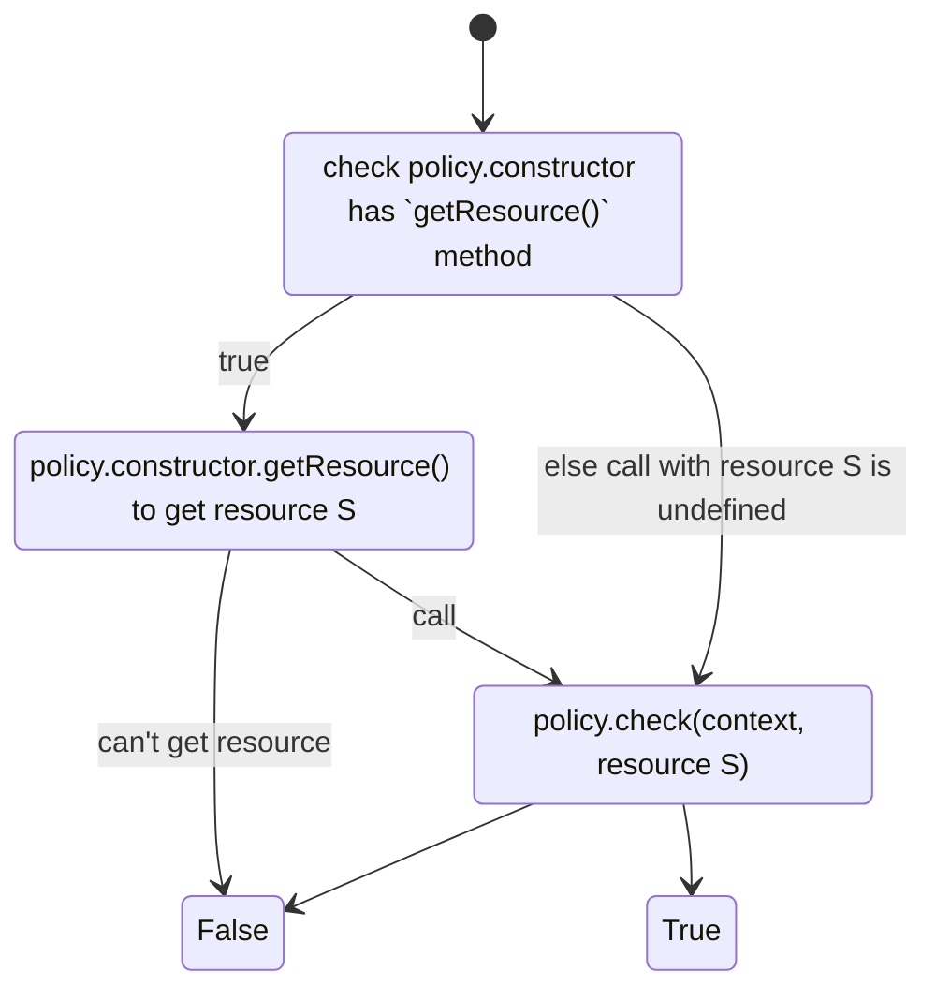

## Giới thiệu về Policy

RoxaVN có cách tiếp cận kiểm soát quyền truy cập (authorization) khác biệt so với các framework truyền thống. Thay vì phải tự kiểm tra quyền trong từng hàm xử lý (controller/service), RoxaVN cho phép bạn định nghĩa các policy ngay tại khai báo API.  

Nhờ vậy:
- **Backend** không cần viết lại các đoạn `if (!hasPermission) throw forbiddenException()` nữa, vì đã có `AuthorizationMiddleware` tự động kiểm tra.  
- **Frontend** không cần tự xử lý quyền thủ công, mà chỉ cần dùng các tiện ích sẵn có như component `<IfCanAccessApi />` hoặc hook `useAuthorization()`.

Ví dụ trên Frontend:

```tsx
<IfCanAccessApi api={messageApi.getMany} children={<ListMessages />} />
````

Đoạn code trên sẽ:

* Kiểm tra xem user hiện tại có quyền gọi API `messageApi.getMany` hay không.
* Nếu có quyền, component `<ListMessages />` sẽ được hiển thị.
* Nếu không có quyền, component đó sẽ không render — giúp giao diện tự động ẩn các phần không được phép truy cập.

### Định nghĩa policy trong API

Mỗi API trong RoxaVN có thể định nghĩa danh sách các policy kiểm tra quyền thông qua thuộc tính `authorization.policies`. Cấu trúc như sau:

```ts
authorization: {
  policies: Array<(context: PolicyContext) => BasePolicy | undefined>,
},
```

Trong đó:

* `context` là ngữ cảnh hiện tại, có kiểu là `PolicyContext` bao gồm thông tin người dùng, request khi gọi api.
* Mỗi phần tử trong mảng `policies` là một hàm trả về
  * `BasePolicy` — dùng để mô tả logic kiểm tra quyền cụ thể.
  * `undefined` - không được phép
* Khi có **ít nhất một policy hợp lệ**, user được phép truy cập API.
* Nếu **không có policy nào cho phép**, server sẽ tự động trả về lỗi **403 Forbidden** mà không cần viết thêm code.

### BasePolicy

`BasePolicy` là một abstract class trong RoxaVN, được dùng làm nền tảng để xây dựng các chính sách kiểm tra quyền truy cập (authorization policy). Mỗi policy kế thừa từ `BasePolicy` sẽ định nghĩa điều kiện kiểm tra quyền riêng biệt, giúp hệ thống linh hoạt và dễ mở rộng.

```ts
abstract class BasePolicy<T, S> {
  abstract priority: number;

  abstract check: (context: PolicyContext, resource: S) => boolean;

  constructor(public data: T) {}

  static getResource(context, data: T): S;
}
```

#### Giải thích chi tiết

| Thành phần                                                           | Mô tả                                                                                                                                                                                                                                                    |
| -------------------------------------------------------------------- | -------------------------------------------------------------------------------------------------------------------------------------------------------------------------------------------------------------------------------------------------------- |
| **priority**:`number`                                                | Độ ưu tiên của policy. Khi có nhiều policy cùng kiểm tra, RoxaVN sẽ sắp xếp theo thứ tự `priority` (thấp hơn chạy trước).                                                                                                                                |
| **check**(context: `PolicyContext`, resource: `S`) => `boolean`      | Hàm kiểm tra điều kiện với đầu vào là PolicyContext và resource S được lấy từ hàm static `getResource()`, nếu policy không định nghĩa `getResource()` thì resource sẽ là undefined. Trả về `true` nếu user được phép truy cập, ngược lại trả về `false`. |
| **constructor**(data: `T`)                                           | Truyền dữ liệu khởi tạo cho policy module.                                                                                                                                                                                                               |
| *static* **getResource**(context: `PolicyContext`, data: `T`) => `S` | Hàm tiện ích dùng để trích xuất dữ liệu cần thiết `S` (nếu trả về S là undefined thì coi như kiểm tra quyền thất bại) từ `context` và `data` trước khi gọi `check()`. Không bắt buộc phải khai báo                                                       |

#### Flow kiểm tra policy 



#### Ví dụ minh họa

Giả sử bạn muốn định nghĩa một policy cho phép người dùng truy cập API khi có quyền

```ts
export class SimpleRolePolicy extends BasePolicy {
  priority = 10;

  check = (
    _context: PolicyContext,
    role: { permissions: string[] }
  ) => {
    return role.permissions.includes(this.data.permission);
  };

  constructor(data: {permission: string}}) {
    this.data = data;
  }

  static async getResource(
    ctx: PolicyContext,
    data: SimpleRolePolicy['data']
  ): Promise<{ permissions: string[] }> {
    throw new Error('[RolePolicy] Must define ' + ctx + data);
  }
}
```

* **`check()`**
  Hàm kiểm tra quyền thực tế. RoxaVN sẽ truyền vào `context` và dữ liệu được lấy từ `getResource()`.
  Trong ví dụ trên, hàm chỉ đơn giản kiểm tra xem `permission` của policy có nằm trong danh sách `role.permissions` hay không.

* **`getResource()`**
  Đây là hàm **bắt buộc override** trên từng môi trường (Backend hoặc Frontend) để xác định cách lấy `role` của người dùng:

  * **Backend:** sẽ truy vấn cơ sở dữ liệu để lấy danh sách quyền (`permissions`) của user.
  * **Frontend:** sẽ lấy thông tin `role` từ `RolesContext`.

> ⚠️ Nếu bạn không override `getResource()` ở môi trường tương ứng, policy sẽ ném lỗi như trong ví dụ trên (`throw new Error(...)`).

Cách dùng

```ts
const messageApi = {
  create: messageSource.create({
    request: Type.Any({}),
    authorization: {
      policies: [
        (context) =>
          new SimpleRolePolicy({
            permission: permissions.CreateMessage.name,
          }),
      ],
    },
  }),
}
```

## Role-based access control

Ví dụ `SimpleRolePolicy` ở trên chỉ minh họa cách kiểm tra quyền đơn giản. Trong thực tế, RoxaVN hỗ trợ **mô hình phân quyền đa tầng (multi-scope)** để xử lý các trường hợp phức tạp hơn, nơi mà một người dùng có thể có nhiều vai trò khác nhau ở các phạm vi khác nhau.

### Vấn đề thực tế

Hệ thống phân quyền của RoxaVN được thiết kế để giải quyết các bài toán như sau:

- Mỗi **module** trong RoxaVN có thể có **các chức vụ (role)** riêng biệt với **quyền (permission)** cụ thể để quản lý dữ liệu trong module đó.  
  - Module `@roxavn/module-message` có role `Admin` với quyền *xem*, *sửa*, *xoá* tất cả `Channel` và `Message`.
  - Module `@roxavn/module-project` có role `Admin` (chỉ cùng tên, khác id với role `Admin` của @roxavn/module-message) với quyền *xem*, *sửa*, *xoá* tất cả `Project` và `Task`.

- Bên cạnh đó, trong từng **phạm vi nhỏ hơn** (như Channel, Project, ...), người dùng có thể có **role riêng biệt**.  
  → Ví dụ: trong channel “Tin tức về RoxaVN” (id = 1), người dùng có thể mang vai trò `ChannelAdmin` hoặc `ChannelModerator`, cho phép họ *xem*, *sửa*, *xoá* tất cả `Message` thuộc riêng channel này.

### Role

Để hỗ trợ mô hình trên, RoxaVN định nghĩa đối tượng `Role` với các thuộc tính sau:

| Thuộc tính      | Kiểu dữ liệu | Mô tả                                                                                                                                                              |
| --------------- | ------------ | ------------------------------------------------------------------------------------------------------------------------------------------------------------------ |
| **id**          | `string`     | Id của chức vụ                                                                                                                                                     |
| **name**        | `string`     | Tên của chức vụ (ví dụ: `Admin`, `Viewer`, `Moderator`, ...)                                                                                                       |
| **scope**       | `string`     | Tên của phạm vi áp dụng quyền. Ví dụ: <br> - `@roxavn/module-message` cho role cấp module <br> - `channel` cho role cấp channel                                    |
| **scopeId**     | `string`     | ID của phạm vi. <br> - Với role module, `scopeId = '*'` (áp dụng cho toàn bộ module). <br> - Với role cấp channel, `scopeId` chính là ID của channel (ví dụ: `1`). |
| **permissions** | `string[]`   | Danh sách quyền mà role được cấp (ví dụ: `CreateMessage`, `DeleteMessage`, `EditChannel`, ...).                                                                    |

### RolePermissionPolicy

RoxaVN có sẵn `RolePermissionPolicy` để thực hiện kiểm tra quyền với role theo từng scope như trên

```ts
import { Scope } from '@roxavn/core';
import { baseModule } from './module.js';
import { scopes } from './access.js';

const channelApi = {
  get: channelSource.create({
    request: Type.Object({ id: Type.String() }),
    authorization: {
      policies: [
        (context) =>
          new RolePermissionPolicy({
            permission: permissions.ReadChannel.name,
            scope: baseModule.name,
            scopeId: Scope.ANY_ID, // '*'
          }), // kiểm tra user có quyền ReadChannel trong @roxavn/module-message không
        ({ request }) =>
          new RolePermissionPolicy({
            permission: permissions.ReadChannel.name,
            scope: scopes.Channel.name,
            scopeId: request.id,
          }), // kiểm tra user có quyền ReadChannel trong scope Channel với scopeId là id của channel 
      ],
    },
  }),
}
```

RoxaVN cung cấp sẵn helper `policies` (đọc thêm doc trong '@roxavn/core' để tìm hiểu chi tiết), giúp định nghĩa policy dễ đọc và súc tích hơn.

```ts
import { policies } from '@roxavn/core';

const channelApi = {
  getOne: channelSource.create({
    request: Type.Object({ id: Type.String() }),
    authorization: {
      policies: [
        policies.Module(baseModule, permissions.ReadChannel),
        policies.ScopeRole({
          scope: scopes.Channel,
          permission: permissions.ReadChannel,
        }),
      ],
    },
  }),
}
```

### ApiRolesGetter

Như đã giới thiệu ở phần đầu, ứng dụng web của RoxaVN được chia thành ba phần chính Admin Dashboard, Personal Profile, Custom Application. Mỗi phần có cơ chế quản lý quyền (role & permission) khác nhau, nhưng đều sử dụng chung kiến trúc `ApiRolesGetter` và `RolesContext` để quản lý quyền người dùng trên frontend.

#### 1. Admin Dashboard

Trong Admin Dashboard, khi người dùng truy cập, client sẽ tự động lấy toàn bộ danh sách `role` mà user đang có trong các module bằng component `ApiRolesGetter`.

```tsx
// Component ApiRolesGetter có nhiệm vụ lấy danh sách `role` của người dùng,
// sau đó lưu vào RolesContext để các component con có thể sử dụng lại.
<ApiRolesGetter api={authService.getUserModulesApi}>
  <AdminComponent />
</ApiRolesGetter>
````

Sau khi `RolesContext` được khởi tạo, tất cả các trang hoặc component con có thể sử dụng các cơ chế kiểm tra quyền như:

```tsx
<IfCanAccessApi api={messageApi.create}>
  <CreateMessageButton />
</IfCanAccessApi>
```

> ✅ **Lưu ý:**
> Trong Admin Dashboard, bạn không cần gọi lại API để lấy role của người dùng — vì `ApiRolesGetter` đã tự động xử lý điều này ngay từ đầu.

#### 2. Personal Profile và Custom Application

Đối với Personal Profile hoặc ứng dụng tuỳ chỉnh, quyền truy cập thường phụ thuộc vào **phạm vi (scope)** cụ thể — ví dụ như từng đối tượng như `Channel`, `Project`, ...

Trong các trường hợp này, bạn cần đặt component `ApiRolesGetter` ở cấp phạm vi của đối tượng, để chỉ lấy các role có liên quan đến scope đó.

```tsx
<ApiRolesGetter 
  api={authService.getUserRolesApi} // không yêu cầu set vì mặc định là authService.getUserRolesApi 
  apiRequest={{ scope: scopes.Channel.name, scopeId: channel.id }}
>
  <ChannelDetail />
</ApiRolesGetter>
```

* `scope`: tên của phạm vi cần lấy quyền (ví dụ: `"channel"`).
* `scopeId`: định danh cụ thể của phạm vi (ví dụ: `channel.id = "1"`).

Sau đó `RolesContext` sẽ lưu role cho phạm vi này, toàn bộ các component con bên trong (như danh sách tin nhắn, hành động xoá, ghim, chỉnh sửa, v.v.) có thể sử dụng trực tiếp `IfCanAccessApi` để kiểm tra quyền.

#### 3. Cách hoạt động tổng quát

1. `ApiRolesGetter` gọi API lấy danh sách role tương ứng với **scope** và **scopeId**.
2. Các role được lưu vào `RolesContext`.
3. `IfCanAccessApi` và `useAuthorization()` tự động đọc dữ liệu trong `RolesContext` để kiểm tra quyền truy cập.
4. Nếu người dùng không có quyền phù hợp, component sẽ không hiển thị hoặc thao tác sẽ bị vô hiệu hóa.

## Attribute-based access control

Ngoài việc kiểm tra quyền theo role và permission, RoxaVN còn hỗ trợ kiểm soát truy cập dựa trên thuộc tính của tài nguyên (resource attributes) thông qua `ResourceConditionPolicy`.

Điều này cho phép bạn xác định các điều kiện linh hoạt — ví dụ chỉ cho phép truy cập nếu tài nguyên là **public**

```ts
export const projectApi = {
  getOne: projectSource.getOne({
    request: Type.Object({
      id: Type.String({ minLength: 1 }),
    }),
    authorization: {
        (ctx) =>
          new ResourceConditionPolicy(
            // Điều kiện để truy vấn tài nguyên Project cần kiểm tra
            { scope: scopes.Project, condition: { id: ctx.request.id } },

            // Hàm kiểm tra thuộc tính `isPublic` của tài nguyên
            (_ctx, resource) => resource.isPublic
          ),
      ],
    },
  })
};
```

Hoặc kiểm tra phức tạp hơn: chỉ cho phép user xem project nếu project là public hoặc thuộc về chính họ.

```ts
(ctx) =>
  new ResourceConditionPolicy(
    { scope: scopes.Project, condition: { id: ctx.request.id } },
    (ctx, resource) => resource.isPublic || resource.ownerId === ctx.user.id
  );
```

### Cơ chế hoạt động

`ResourceConditionPolicy` là một implement cụ thể của `BasePolicy`, với phương thức `getResource()` hoạt động tương tự như ví dụ `SimpleRolePolicy`. Tùy theo môi trường Backend hoặc Frontend, RoxaVN sẽ có cách lấy dữ liệu (resource) khác nhau để thực hiện việc kiểm tra.

#### Backend

Ở backend, `getResource()` sẽ tự động truy vấn database theo điều kiện đã truyền trong `condition`. Ví dụ với đoạn khai báo:

```ts
new ResourceConditionPolicy(
  { scope: scopes.Project, condition: { id: ctx.request.id } },
  (_ctx, resource) => resource.isPublic
);
````

thì câu truy vấn tương ứng sẽ được thực hiện như sau:

```sql
SELECT * FROM project WHERE id = $1;
```

Dữ liệu nhận được sẽ được truyền vào callback `(ctx, resource)` để kiểm tra điều kiện (`resource.isPublic` trong ví dụ trên).

#### Frontend

Ở frontend, `getResource()` sẽ không truy vấn database, mà thay vào đó lấy dữ liệu từ `ScopesContext`. Khi bạn sử dụng component `<ApiFetcher />`, sau khi client gọi API và nhận được dữ liệu, RoxaVN sẽ:

1. Lưu dữ liệu này vào `ScopesContext` với scope tương ứng trong API. 
2. Nếu dữ liệu là 1 danh sách các đối tượng thì lưu từng đối tượng với id của nó.
3. Khi `ResourceConditionPolicy` được gọi, nó sẽ tự động lấy resource từ `ScopesContext` để kiểm tra.

Điều này giúp việc kiểm tra quyền ở frontend diễn ra tức thì, không cần gọi API phụ để xác minh lại.

#### Ví dụ dùng với ApiFetcher

Ví dụ cho phép bất cứ ai có thể cập nhật project nếu project đó công khai.

```tsx
export const projectApi = {
  // API lấy thông tin Project
  getMany: projectSource.getMany({
    request: Type.Object({
      userId: Type.String({ minLength: 1 }),
    }),
    authorization: {
      // chỉ cho phép nếu `userId` trong request trùng với user id được xác thực
      policies: [policies.Owner]
    }
  }),
  // API cập nhật Project 
  update: projectSource.update({
    request: Type.Object({
      id: Type.String({ minLength: 1 }),
      name: Type.String({ minLength: 1 }),
    }),
    authorization: {
      policies: [
        (ctx) =>
          // cập nhật nếu project là công khai
          new ResourceConditionPolicy(
            { scope: scopes.Project, condition: { id: ctx.request.id } },
            (_ctx, resource) => resource.isPublic
          ),
      ]
    },
  }),
};
```

Ở phía frontend, bạn có thể dùng ApiFetcher để lấy dữ liệu Project, và kết hợp IfCanAccessApi để hiển thị form cập nhật chỉ khi user có quyền cập nhật (tức Project công khai).

```tsx
// lấy thông tin user đăng nhập hiện tại
const user = useAuthUser();
<ApiFetcher 
  api={projectApi.getMany} 
  initialApiRequest={{ userId: user.id }}
  renderData={({data}) => data && data.items.map(item => (
    <div key={item.id}>
      <ProjectInfo project={item} />
      <IfCanAccessApi api={projectApi.update}>
        <UpdateProjectForm project={item} />
      </IfCanAccessApi>
    </div>
  ))}
/>
```

Giải thích:

- ApiFetcher gọi `projectApi.getMany` để tải tất cả Project của user.
- Kết quả được lưu vào `ScopesContext` theo scope Project.
- `<IfCanAccessApi />` tự động chạy policy của `projectApi.update` để kiểm tra quyền.
- Nếu Project có isPublic = true, form `<UpdateProfileForm />` sẽ hiển thị; ngược lại, component này sẽ không render gì cả.

=> Nhờ cơ chế này, `ResourceConditionPolicy` hoạt động nhất quán trên cả backend và frontend, giúp định nghĩa quyền truy cập một lần nhưng sử dụng ở cả hai phía mà không cần viết lại logic kiểm tra.
